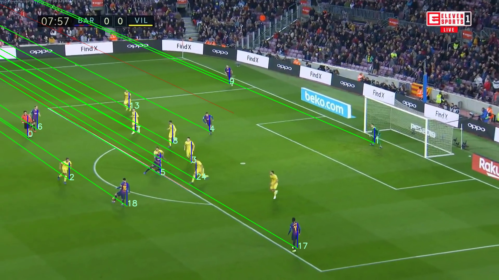
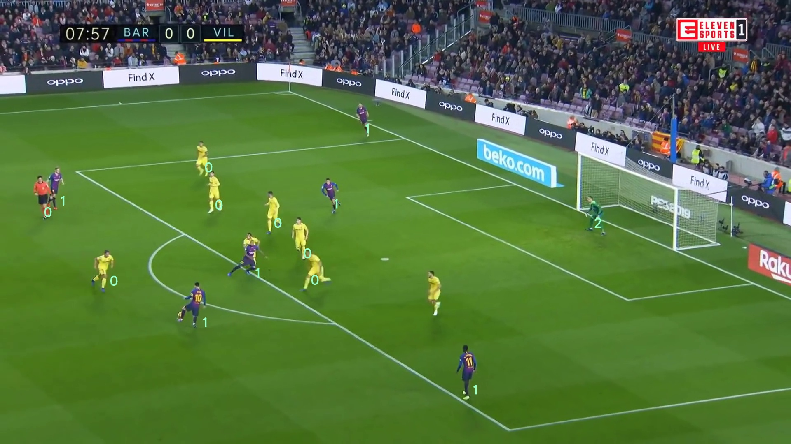

# Computer Vision based Offside Detection in soccer

## Paper Details

### Link :  https://doi.org/10.1145/3422844.3423055

### Citation:
```
@inproceedings{
  10.1145/3422844.3423055,
  author = {Panse, Neeraj and Mahabaleshwarkar, Ameya},
  title = {A Dataset & Methodology for Computer Vision Based Offside Detection in Soccer},
  year = {2020},
  isbn = {9781450381499},
  publisher = {Association for Computing Machinery},
  address = {New York, NY, USA},
  url = {https://doi.org/10.1145/3422844.3423055},
  doi = {10.1145/3422844.3423055},
  series = {MMSports '20}
}
```

Offside decisions are an integral part of every soccer game. In recent times, decision-making in soccer games, including offside decisions, has been heavily influenced by technology. However, in spite of the use of a Video Assistant Referee (VAR), offside decisions remain to be plagued with inconsistencies. The two major points of criticism for the VAR have been extensive delays in providing final decisions and inaccurate decisions arising from human errors. The visual nature of offside decision-making makes Computer Vision techniques a viable option for tackling these issues, by automating appropriate aspects of the process. This repo is an extention of the above research and can be used for predicting players in an offside position, given an image of a specific scene in a soccer match.


*In this scenario, Lionel Messi(Jersey no. 10) has the ball, while two other players from his team are in a clear offside position*

## Brief description of the algorithm


1. Finding the vertical vanishing lines and vanishing point using the markings on the field to determine the relative position of all the players with respect to the field.

2. Finding the farthest horizontal projection of the playable body parts of all players(necessary for the offside rule)


*The vertical vanishing lines(depicted in red) drawn from a single vertical vanishing line. Relative positions of all players from the vanishing point(green) and projection of their farthest body part (blue)*

3. Classifying the people on the field into Team1, Team2 and the Goalkeeper by clustering their jersey colours.


*All players and the goalkeeper have been classified into their respective categories. [0 : TEAM-A, 1 : TEAM-B]*


4. Finding all players in an offside position using the novel computation algorithm defined in the paper.


*All attacking team players classified as OFF or ON based on their location. The last man of the defending team is highlighted as well*


## Steps to run the system

1. Create the conda environment using the yml file. Note that some of the dependancies might be from the time when the code was written and might need an upgrade.

    ```conda env create -f environment. yml```

2. Download the models for pose estimation from the link given below.

3. Configure and run  ```main.py``` with output folders for the intermediate results. The output images will be generated in the configured folders.

    ``` python3 main.py ```


## Artifacts

Dataset : [Drive Link](https://drive.google.com/drive/folders/1TgxT-9GRB3BWice_5WHuCQ4Byev-NHFI?usp=sharing)

Models : [Drive Link](https://drive.google.com/drive/folders/1DW0G-zgLs3g_rf3QnWQGjQ7euCJPaOs3?usp=sharing)